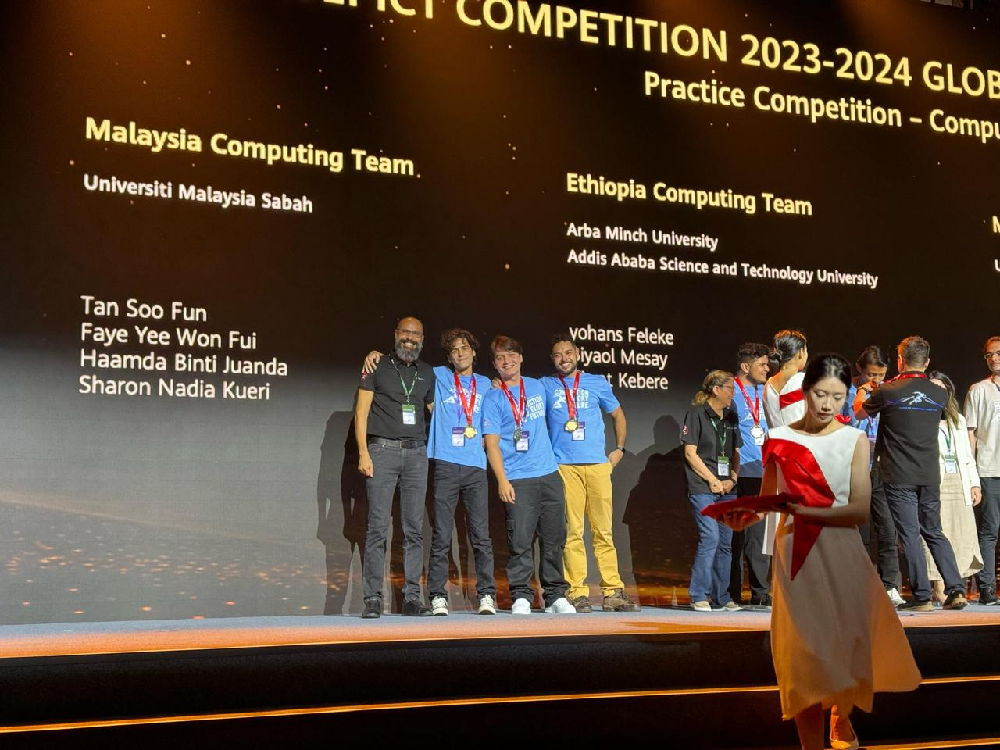
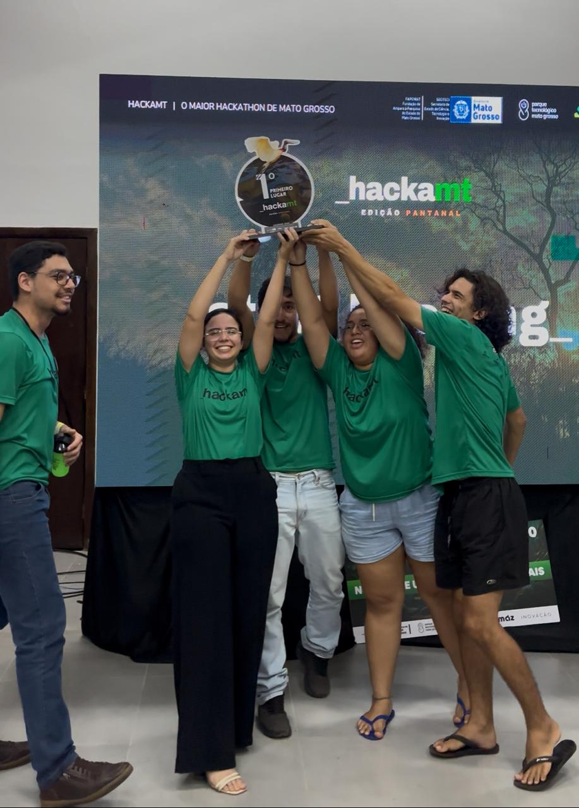

  

---

### 🚀 Sobre Mim

Atualmente, sou acadêmico de **Ciência da Computação** na **UNEMAT** (Universidade do Estado de Mato Grosso) e atuo como **Estagiário de TI** na mesma instituição. 

Sou um entusiasta de tecnologia focado no desenvolvimento de soluções eficientes e escaláveis. Minha jornada é movida por desafios técnicos e pela busca constante de conhecimento em arquitetura de software e sistemas de alta performance.

  
  

---

### 🏆 Conquistas e Competições

  <h3>🌍 Huawei ICT Competition 2024</h3>
  
<i>Sistemas Operacionais Linux & Banco de Dados</i>

  
   
  

    🥇 <b>Nacional:</b> 1º Lugar | 
    🥉 <b>América Latina:</b> 3º Lugar | 
    🥉 <b>Mundial (China):</b> 3º Lugar
  

 

  <h3>🎖️ HackaMT 2025</h3>
  
<i>Plataforma de Gerenciamento de Vacinas</i>

  
   
  
🥇 <b>1º Lugar Geral</b> (Maio de 2025)

---

### 🛠️ Tecnologias & Stack

  

 

**🌱 No radar de estudos:**

  

---

### 📫 Conecte-se comigo

  
  

