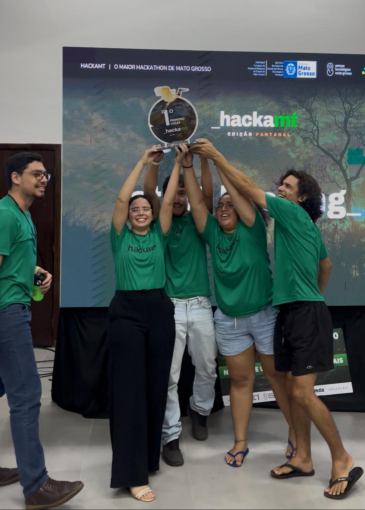

<div align="center">

# Léo Walker

### Desenvolvedor back-end & pesquisador

Construo software e pesquiso tecnologia — de APIs e produtos digitais a inteligência artificial, automação e segurança.

[](https://leo-walker-portfolio.netlify.app)
[](https://www.linkedin.com/in/leowalker4408)

</div>

---

```text
leo@github:~$ whoami
Desenvolvedor com foco em Java e Spring Boot, criando aplicações completas,
APIs REST e soluções para problemas reais.

leo@github:~$ interests
Arquitetura de software · IA · automação · segurança · pesquisa aplicada
```

## Stack

**Back-end:** Java 21, Spring Boot, Node.js, TypeScript, REST APIs<br />
**Front-end:** React, TypeScript, Tailwind CSS<br />
**Dados e mensageria:** PostgreSQL, RabbitMQ, Flyway, Hibernate/JPA<br />
**Infraestrutura e qualidade:** Docker, Git, Maven, testes e observabilidade

<p>
  
</p>

## Projetos selecionados

### [VejaBD — SchemaLens](https://github.com/walkermooore/vejabd)

Explorador visual *local-first* de metadados PostgreSQL. Mapeia tabelas, chaves, índices, dependências, impacto transitivo, tamanho e possíveis gargalos sem consultar os dados das aplicações.

`Java` `React` `TypeScript` `PostgreSQL` `Docker`

### [Angel](https://github.com/walkermooore/angel)

E-commerce full stack com catálogo, checkout, pedidos, reserva transacional de estoque e painel administrativo. Inclui autenticação com 2FA, outbox, filas, retry e DLQ.

`Java 21` `Spring Boot` `React 19` `PostgreSQL` `RabbitMQ`

### [GeoCarioca](https://github.com/walkermooore/geocarioca)

Plataforma de aluguel de temporada para o Rio de Janeiro, com pesquisa de imóveis, tarifas dinâmicas, solicitações de reserva e painel seguro para gestão de propriedades.

`Java 21` `Spring Boot` `React 19` `TypeScript` `PostgreSQL`

### [Imuniza](https://github.com/walkermooore/imuniza)

Sistema de gestão e rastreabilidade de vacinas criado no HACKA-MT. Controla o ciclo dos lotes, evita a abertura duplicada de frascos, registra auditoria e gerencia transferências entre unidades.

`Node.js` `TypeScript` `React 19` `PostgreSQL` `Tailwind CSS`

## Conquistas

<table>
  <tr>
    <td width="50%" valign="top">
      
      <h3>Huawei ICT Competition</h3>
      <p>3º lugar na América Latina na trilha Computing e participação na final global 2023–2024, em Shenzhen, representando o Brasil e a UNEMAT.</p>
    </td>
    <td width="50%" valign="top">
      
      <h3>1º lugar no HACKA-MT 2025</h3>
      <p>O Imuniza transformou um problema de saúde pública em uma solução para reduzir o desperdício de vacinas e melhorar a rastreabilidade.</p>
    </td>
  </tr>
</table>

## Pesquisa e artigos

Também escrevo sobre inteligência artificial, governança, privacidade, DevSecOps, saúde digital e cibersegurança. Os cinco trabalhos publicados estão reunidos na seção de artigos do meu portfólio.

[**Ler artigos →**](https://leo-walker-portfolio.netlify.app/#artigos)

## Contato

- [LinkedIn — leowalker4408](https://www.linkedin.com/in/leowalker4408)
- [Portfólio — leo-walker-portfolio.netlify.app](https://leo-walker-portfolio.netlify.app)
- [GitHub — walkermooore](https://github.com/walkermooore)

---

<p align="center"><sub>Software, pesquisa e produtos digitais.</sub></p>
